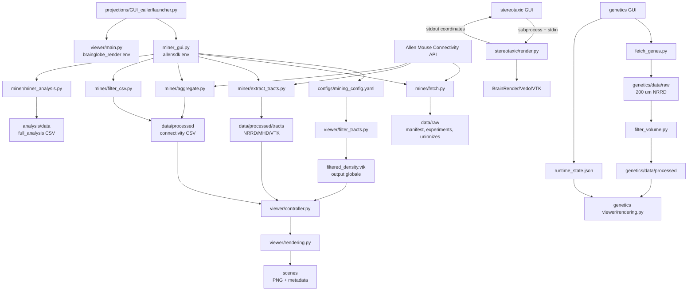

# Full Code Review - Neuroglobe

Review eseguita sul codice e sui dati presenti nella workspace il 2026-07-31.
Il codice e' stato trattato come fonte primaria; README, piani e commenti sono
stati usati soltanto per individuare divergenze.

## Executive Summary

Neuroglobe contiene idee e prototipi utili, ma non e' oggi una suite
scientificamente validata o riproducibile. La parte `projections` ha test
unitari parziali e dati demo concreti; `genetics` e `stereotaxic` sono
prototipi senza test automatici. I blocker piu' importanti riguardano assi
anatomici, metadata dei volumi, collisione degli import e provenance.

Conteggio finding:

| Severity | Totale |
| --- | ---: |
| Critical | 4 |
| High | 12 |
| Medium | 9 |
| Low | 5 |
| Documentation only | 4 |
| **Totale** | **34** |

Raccomandazione: sospendere l'uso quantitativo di Ipsilateral,
Contralateral, Both, tract alignment e genetics spatial localization finche'
i quattro finding Critical non siano corretti e verificati con phantom e
landmark noti.

## Architecture Map



### Confini reali

- `projections` e' l'unico modulo con `pyproject.toml`, ambienti Conda e pytest.
- `genetics` replica il pattern `src`, ma non e' un package autonomo e usa gli
  ambienti definiti dentro `projections`.
- `stereotaxic` e' composto da due script standalone.
- Non esiste un package Python comune per config, atlas geometry, process
  supervision, provenance o data model.
- Ogni modulo risolve i path con euristiche proprie; `projections` e
  `genetics` espongono entrambi un namespace top-level chiamato `src`.

### Flussi dati reali

`projections`:

```text
seed acronym
  -> Allen experiments DataFrame
  -> unionizes di tutti gli esperimenti
  -> value_mean/value_ipsi/value_contra/value_left/value_right
  -> CSV completo + CSV target-filtered

esperimento con injection_volume massimo
  -> projection density volume
  -> NRRD processato
  -> maschera target opzionale
  -> isosurface VTK
  -> BrainRender scene
```

`genetics`:

```text
lista geni in manifest.json
  -> primo dataset Allen scaricabile per gene
  -> MHD/RAW temporanei condivisi
  -> NRRD 200 um
  -> maschera atlas ridimensionata
  -> NRRD filtered
  -> seconda maschera runtime
  -> 90esimo percentile non-zero
  -> legosurface
```

`stereotaxic`:

```text
checkbox/acronimi + slider AP
  -> subprocess BrainRender
  -> clipping plane aggiornato via stdin
  -> coordinate approssimate inviate via stdout
```

## Findings

### Critical

| ID | Titolo e area | Evidenza | Impatto | Fix suggerito | Test raccomandato |
| --- | --- | --- | --- | --- | --- |
| C1 | Laterality e split emisferico usano l'asse anatomico sbagliato. `projections/src/miner/aggregate.py:90-103`, `projections/src/viewer/rendering.py:81-105`, `stereotaxic/src/render.py:82-85` | Aggregate classifica l'injection con `injection_x < 5700`; stereotaxic dichiara X=AP e Z=ML. Nei 2.992 record cache, usare X invece di Z cambia la classificazione di 1.187 record (39,7%). L'esperimento DR 480074702 passa da code-right a ML-left. Il test `test_aggregation.py:25-27` codifica la stessa assunzione errata. | Ipsilateral e Contralateral possono essere invertiti; Both taglia il cervello su un piano coronal/AP invece che medio-sagittale. | Definire una convenzione atlas unica e tipizzata; usare la coordinata ML verificata dal metadata Allen; derivare piano e midpoint dalla shape/resolution, non da una costante. Rigenerare tutti i CSV. | Phantom con due injection speculari e valori noti Left/Right; test su coordinate reali Allen; screenshot pixel/mesh che verifichi due emisferi, non due segmenti AP. |
| C2 | L'estrazione projection density perde geometria e orientamento. `projections/src/miner/extract_tracts.py:45-59`, `projections/src/viewer/rendering.py:145-206`, `projections/configs/visual_config.yaml:13-24` | Il file Allen originale osservato e' size `(528,320,456)`, spacing `(25,25,25)`; i file prodotti sono `(456,320,528)`, spacing `(1,1,1)`. `GetImageFromArray` inverte l'ordine e il codice imposta spacing solo se il dict contiene `resolution`, condizione non presente nei file reali. Il viewer applica scaling euristico e rotazioni Y 270 + Y 90, equivalenti a 360 gradi. | Tratti e target possono apparire plausibili ma essere registrati sull'area anatomica sbagliata. Mesh derivate e scene storiche non sono scientificamente affidabili. | Preservare direttamente volume e header Allen oppure costruire una trasformazione esplicita da array order a physical space con spacing, origin e direction. Eliminare scaling/rotation heuristics. | Golden test che confronti size, spacing, origin, direction e 3 landmark tra NRRD Allen, NRRD processato e mesh; Hausdorff/dice contro una maschera nota. |
| C3 | Genetics scambia assi corretti prima del rendering e applica una maschera su assi incompatibili. `genetics/src/viewer/rendering.py:139-166` | Gli NRRD genetics osservati sono `(67,41,58)`, spacing 200 e bounds `(13200,8000,11400)`, coerenti con CCF AP/DV/ML. `permute_axes(2,1,0)` li trasforma in `(58,41,67)` e bounds `(11400,8000,13200)`. La maschera atlas `(528,320,456)` viene poi ridimensionata direttamente sulla shape scambiata. `genetics/test_orient.py:19-35` usa invece il volume senza permutazione. | Voxel di espressione possono essere visualizzati in regioni errate; il secondo masking puo' eliminare segnale corretto o conservarne di estraneo. | Rimuovere la permutazione non necessaria e usare physical-space resampling con affine esplicito. Scegliere un solo punto della pipeline in cui applicare la maschera. | Landmark test AP/DV/ML su volume sintetico asimmetrico; overlap con almeno tre regioni non simmetriche; verifica bounds prima/dopo render. |
| C4 | Il namespace generico `src` puo' eseguire codice di un altro progetto. `projections/src/miner/extract_tracts.py:1-6`, `projections/pyproject.toml:55-57`, import analoghi in `genetics` | `extract_tracts.py` importa `src` prima di aggiungere il root locale. Simulando il path dello script nell'ambiente `allensdk`, `src.__path__` risolve a `C:\Projects python\Neuroglobe 3.0\src`. L'ambiente contiene infatti `neuroglobe 3.0.0` editable. | Una run di Neuroglobe corrente puo' mescolare definizioni, config e funzioni di Neuroglobe 3.0; su una macchina pulita puo' fallire con `ModuleNotFoundError`. | Creare package nominati (`neuroglobe.projections`, `neuroglobe.genetics`), entry point console e import relativi; rimuovere ogni modifica a `sys.path`; disinstallare le editable obsolete dopo la migrazione. | Avviare ogni entry point da cwd differenti in un env pulito; assert su `module.__file__`; test che fallisca se un import proviene fuori dal checkout corrente. |

### High

| ID | Titolo e area | Evidenza | Impatto | Fix suggerito | Test raccomandato |
| --- | --- | --- | --- | --- | --- |
| H1 | Migrazione Git incompleta e policy dati non aggiornata. Root Git e `.gitignore:37-57` | Git mostra vecchi file root cancellati, 496 file nuovi sotto i tre moduli, ma nessun file dei moduli e' tracciato. `projections` occupa circa 3.8 GB; file singoli arrivano a 626 MB. Le regole `data/raw/*` e `data/processed/tracts/` non coprono i nuovi path annidati. | Rischio di commit che perde il codice nuovo, duplica la storia o tenta di inviare gigabyte a GitHub. | Completare la move con `git mv`/staging controllato; aggiornare ignore per modulo; tenere solo fixture minime; spostare dati reali in storage versionato con manifest/hash o Git LFS. | CI che rifiuti file oltre soglia, dati non consentiti e moduli non tracciati; clone pulito seguito da smoke test. |
| H2 | Packaging e versioni non riproducibili. `projections/pyproject.toml:5-57`, env YAML, root README precedente | `pyproject` 4.0.0 referenzia README e LICENSE assenti dentro `projections`; richiede pandas >=2.3.3, mentre il miner usa pandas 1.5.3. Cartella 5.0, README precedente 6.0, env installato 3.0.0 da un'altra directory. `requirements.txt` include `python==3.10.*` e `pathlib` come se fossero package pip. | Installazione editable/build non affidabile e ambienti diversi eseguono codice/dipendenze differenti. | Un solo `pyproject.toml` root, lockfile per ambiente, metadata esistenti, version source unica, dipendenze separate per miner/viewer/dev. Rimuovere stdlib e sintassi Conda dal requirements pip. | Build wheel/sdist in env pulito, install smoke test, `pip check`, test matrix Python supportata. |
| H3 | Entry point Fetch Experiments rotto. `projections/src/miner/fetch.py:53-62` | Esecuzione nell'ambiente `allensdk` termina a riga 59 con `NameError: DATA_RAW_PATH is not defined`; la variabile reale importata e' `RAW_DATA_DIR`. | Il primo pulsante della pipeline Miner non funziona. | Usare una sola costante path e spostare il main in funzione testabile che restituisca exit code. | Test subprocess dell'entry point con AllenSDK mockato e temporary directory. |
| H4 | Il volume filtrato non e' legato a esperimento o configurazione. `projections/src/viewer/controller.py:150-156,205-212`, `filter_tracts.py:19,48-165` | Ogni filtro scrive `filtered_density.vtk`; il viewer lo riusa per qualunque `current_tract_id`. I target vengono letti da `mining_config.yaml`, non dalle righe correnti della GUI. I file esistenti hanno date diverse e nessun sidecar identificativo. | Un CSV puo' essere renderizzato con il volume filtrato di un altro animale o di un'altra lista target, senza warning. | Nome/content-addressed `{experiment_id}_{metric}_{config_hash}.vtk`, sidecar provenance e validazione prima del render; passare esplicitamente i target della GUI. | Caricare due CSV e due target set in sequenza; verificare che il viewer rifiuti output stale e selezioni il file corretto. |
| H5 | Quality control configurato ma ignorato. `projections/configs/mining_config.yaml:3,7-9`, `aggregate.py:31-54` | `target_regex`, `min_injection_volume` e `threshold_lower` non sono referenziati da alcun `.py`. Il volume rappresentativo e' scelto soltanto col massimo `injection_volume`. | Dati che l'utente crede filtrati per qualita' entrano nell'aggregazione; il "best experiment" puo' avere injection spillover o qualita' anatomica scarsa. | Validare schema config; applicare QC prima di aggregare; definire score documentato per rappresentativita' e conservare motivazione/ID esclusi. | Fixture con esperimenti sopra/sotto soglia e injection off-target; assert sugli ID inclusi/esclusi e sulla selezione representative. |
| H6 | Full analysis assume tutte le injection a destra. `projections/src/miner/miner_analysis.py:82-102` | `hemisphere_id==2` e' sempre Ipsilateral. Nei 2.992 record cache, 734 (24,5%) hanno coordinata ML/Z sotto il midpoint. | La colonna `lateralization` del full-analysis e analisi downstream possono essere errate per injection a sinistra. | Unire coordinate injection per esperimento e usare la stessa funzione laterality validata di aggregate. | Test con injection sinistra/destra, hemisphere 1/2/3 e record senza coordinate. |
| H7 | BrainRender ha side effect di logging all'import e i workaround non sono efficaci. `projections/src/viewer/main.py:12-36`, `stereotaxic/src/render.py:5-14`, `genetics/src/viewer/rendering.py:8-10` | Collection, `stereotaxic/render.py --help` e import genetics falliscono con PermissionError su `~/.brainglobe/brainrender/log.log`; stereotaxic imposta `settings.DEBUG=True` dopo aver gia' importato il package. Main elimina il log condiviso e interpreta ogni PermissionError come "app gia' aperta". | Viewer e stereotaxic possono non avviarsi in sandbox, multi-instance o profili con permessi limitati. La diagnosi mostrata puo' essere falsa. | Configurare logging prima dell'import con API/env supportata, usare directory app-specific e non cancellare file condivisi; evitare `input()` nei GUI entry point. | Import smoke test con HOME/config temporanei read-only, due processi concorrenti e nessuna console interattiva. |
| H8 | Supervisione subprocess soggetta a deadlock e falsi successi. `miner_gui.py:400-456`, `genetics_gui.py:55-135`, `stereotaxic/src/gui.py:143-187` | stdout viene drenato prima di stderr; un child che riempie stderr puo' bloccarsi. Miner non controlla return code. Genetics avvia il filtro dopo il fetch anche se fallito e stampa sempre "Pipeline Completed Successfully". | GUI congelata, pipeline incompleta presentata come riuscita, impossibilita' di cancel/retry affidabile. | Process supervisor condiviso con `communicate`, lettori concorrenti o merge streams, return code obbligatorio, timeout, cancellation e stato strutturato. | Child fixture che scrive oltre la pipe su stderr e termina non-zero; assert GUI state, stop e mancato avvio step successivo. |
| H9 | Suite pytest dipende da ordine/import e non testa sempre il codice reale. `tests/viewer/test_rendering.py:9-20`, `test_rendering_modes.py:6-19`, `test_miner_analysis.py:9-35`, `test_hemisphere_split.py:7-54` | Mock globali modificano `sys.modules`; Python base produce 23 pass/2 fail, `allensdk` 25 pass sullo stesso subset. Un test replica a mano la funzione lateralization invece di importarla. Il test hemisphere apre una finestra reale. | Verde falso, regressioni scientifiche non rilevate e CI non headless. | Fixture isolate, dependency injection, nessun mock persistente in `sys.modules`, marker `gui/integration`, funzioni pure importabili e test sui dati reali minimi. | Randomizzare ordine test, eseguire ogni file isolato, CI matrix miner/viewer e coverage branch su error path. |
| H10 | Provenance insufficiente per riprodurre un risultato. `aggregate.py:195-198`, `rendering.py:235-249,307-315`, genetics fetch/render | I CSV salvano solo `tract_experiment_id`; scene metadata non include lista esperimenti aggregati, config snapshot/hash, versioni SDK/atlas, query date, source checksums, coordinate convention o commit. Genetics non registra dataset Allen scelto per gene. | Non e' possibile ricostruire con certezza dati, trasformazioni e software che hanno prodotto una figura o statistica. | Manifest run immutabile con UUID, config, input IDs/hash, versioni, atlas metadata, trasformazioni e output hash; linkarlo a CSV, mesh e scene. | Re-run da manifest in directory vuota e confronto hash/tolleranze numeriche. |
| H11 | IPC stereotaxic non e' thread-safe e le coordinate sono presentate con falsa precisione. `stereotaxic/src/render.py:68-88,120-163`, `stereotaxic/ultimarichiesta.md` | Il thread stdin modifica un `vtkPlane` senza schedulare render sul thread grafico. Le costanti Bregma sono commentate come approximate ma la GUI mostra due decimali in mm. Il report utente segnala slider, live coordinates e chiusura non responsivi. | Controlli che non aggiornano la scena, possibili race/crash VTK e coordinate interpretate come stereotaxic esatte. | Event queue verso il render thread; trasformazione stereotaxic validata e versione esplicita; mostrare accuratezza/limiti. | Test IPC con ack, redraw counter e chiusura ripetuta; confronto landmark con dataset stereotaxic di riferimento. |
| H12 | Filtraggio/rendering projection density ha picchi memoria e blocca la GUI. `filter_tracts.py:81-160`, `viewer/gui.py:159-166,168-214`, `rendering.py:148-184` | Un volume contiene 77.045.760 voxel e i file float64 osservati sono circa 588 MB. Si allocano volume, annotation, mask, `logical_or`, inverted mask e mesh; la mesh maggiore e' circa 626 MB. Filter/render vengono chiamati sincronicamente dai callback DearPyGui. | Peak plausibile oltre 1-2 GB, swapping/crash e interfaccia non responsiva; ogni render raw ricostruisce l'isosurface. | Chunking/memory mapping o volume float32, mask in-place, cache keyed, precomputazione mesh, worker process cancellabile e progress reporting. | Benchmark peak RSS/tempo su volume demo; limite memoria in CI performance; test GUI heartbeat durante filter/render. |

### Medium

| ID | Titolo e area | Evidenza | Impatto | Fix suggerito | Test raccomandato |
| --- | --- | --- | --- | --- | --- |
| M1 | Contratto di ritorno CSV incoerente. `projections/src/viewer/logic.py:56-69`, `controller.py:90-103` | Su errore `process_csv_data` restituisce `[]`, ma il controller fa unpack di tre valori. Smoke test con file mancante produce `ValueError`. | Un CSV mancante/malformato rompe il callback invece di mostrare lo stato di errore previsto. | Restituire sempre un result object/tuple oppure sollevare eccezione tipizzata gestita dal controller. | Test file mancante, CSV vuoto, colonne mancanti, tipi invalidi e NaN. |
| M2 | CSV completi contengono molti seed e acronimi duplicati. `aggregate.py:113-115,167-190` | ACA completo: 51 acronimi duplicati e circa 50 righe seed; DR: 47 duplicati. I filtered non hanno duplicati. | Caricando il CSV completo, molte strutture diventano nere come seed e una stessa regione puo' apparire piu' volte. | Distinguere injection structures da primary seed; chiave unica per acronym/hemisphere/mode o dataset normalizzato. | Assert unicita' del CSV viewer-ready e una sola primary seed. |
| M3 | Mean mescola hemisphere 1, 2 e 3. `aggregate.py:128-156` | `s_mean` aggrega tutto `target_df`; i file unionize contengono circa un terzo di righe per ciascun hemisphere ID. Il test non include ID 3. | `value_mean` non e' necessariamente la semplice media Left/Right descritta dalla UI; weighting e duplicazione dipendono dalla semantica Allen "both". | Definire formalmente Mean; calcolarlo da Left/Right oppure usare solo hemisphere 3, con test e nome esplicito. | Fixture con valori 1/2/3 volutamente diversi; confronto con formula documentata. |
| M4 | Target invalidi o volume vuoto non fermano il filtro. `filter_tracts.py:127-164` | Errori regione sono warning; se nessun target e' valido la full mask resta zero. `dmax` puo' essere zero ma viene comunque richiesta un'isosurface e poi scritta. | File vuoto/corrotto o errore tardivo presentato come filtro valido. | Richiedere almeno una mask valida, conteggio voxel >0 e dmax>0; validare output mesh. | Target tutti invalidi, mask vuota e volume all-zero devono fallire con exit code non-zero. |
| M5 | Errori di rendering vengono assorbiti ma il controller restituisce successo. `rendering.py:75-76,116-117,235-237`, `controller.py:235-265` | Ogni regione/tract puo' fallire con log warning/error; `render_scene` termina comunque e il controller ritorna `True`. `tracts_enabled` deriva dal menu, non dalla presenza reale del file. | Scene incomplete e metadata falsi possono sembrare riusciti. | Accumulare errori strutturati, distinguere warning/failure e salvare status reale nel metadata. | Mock di regione/tract falliti; assert return code e metadata. |
| M6 | Download genetics usa HTTP, buffer completo e file temporanei condivisi. `genetics/src/miner/fetch_genes.py:35-100` | URL `http://`, `urlopen` senza timeout, `response.read()` carica lo zip intero, `extractall` usa nomi condivisi `density.mhd/raw`; cleanup rimuove tutti gli MHD/RAW. | Hang, uso memoria, file stale attribuito al gene successivo dopo crash e rischio di estrazione path non validata. | HTTPS, timeout/retry/checksum, directory temporanea per gene/dataset, estrazione sicura e rename atomico. | Download interrotto, zip malevolo/path traversal, due run concorrenti e file stale. |
| M7 | Import e GUI modificano filesystem/config globali. `projections/src/definitions.py:17-20`, `logger_config.py:20-45`, `genetics/src/definitions.py:15-18`, `genetics_gui.py:227-237` | Importare definizioni crea directory; importare logger apre un file; la GUI sovrascrive `runtime_state.json` e config condivisi. | Import non side-effect-free, test/sandbox fragili e sessioni concorrenti che si sovrascrivono. | Creazione directory e logging nel bootstrap; config per-run in directory output; write atomico. | Import in filesystem read-only; due sessioni concorrenti con config diverse. |
| M8 | Utility e script diagnostici hanno path/import rotti. `projections/src/utils/fix_volume_metadata.py:5-9,35`, `check_volume_info.py:5-8`, `genetics/scripts/test_alignment.py:6-14`, `genetics/src/miner/fetch.py:10` | Le utility aggiungono `projections/src` invece del parent necessario a importare `src`; `Path.replace` non equivale a string replace; genetics alignment cerca `src` dalla root; il fetch legacy importa costanti inesistenti. | Diagnostica e recovery non portabili; workaround manuali possono usare package esterni o fallire. | Convertire in comandi package con argparse e Path API (`with_name/with_suffix`); rimuovere o archiviare fetcher legacy. | Smoke test CLI da root e directory casuale, con input Path. |
| M9 | Feature visibili ma non raggiungibili o non implementate. `viewer/controller.py:214-222`, `viewer/gui.py:272-278`, `rendering.py:239-246,342-346` | Controller/render supportano Streamlines ma la combo GUI non offre la modalita'; legend e' disabilitata; `K` non cambia stile; metric 3D e' hardcoded density. | Confusione utente e percorsi non testati che degradano nel tempo. | Feature flags coerenti tra model/controller/view; nascondere codice morto o completarlo con acceptance test. | Test GUI che enumera opzioni e verifica ogni opzione contro un handler implementato. |

### Low

| ID | Titolo e area | Evidenza | Impatto | Fix suggerito | Test raccomandato |
| --- | --- | --- | --- | --- | --- |
| L1 | Duplicazioni e metodi shadowed. `definitions.py:18-19`, `filter_tracts.py:1-11`, `miner_gui.py:179-226,400-456` | `mkdir` duplicato, import duplicati e due definizioni `run_script`/`log_console`; la seconda sostituisce la prima. | Manutenzione ambigua e fix applicati al metodo morto. | Rimuovere duplicati dopo aver coperto il comportamento attivo. | Static check per duplicate definitions/imports. |
| L2 | API Matplotlib deprecata. `projections/src/viewer/logic.py:98` | `cm.get_cmap` genera `MatplotlibDeprecationWarning` e sara' rimosso. | Futuro errore con upgrade Matplotlib. | Usare `matplotlib.colormaps.get_cmap`. | Test colori con Matplotlib supportato minimo/massimo. |
| L3 | Target config duplicato. `projections/configs/mining_config.yaml:14,18` | `PL` compare due volte. | Conteggio/log target fuorviante e lavoro ripetuto. | Deduplicare in validazione mantenendo ordine. | Schema/config unit test per unicita'. |
| L4 | Notebook non uniformi e con output pesanti. `genetics/analysis/*.ipynb`, `projections/analysis/*.ipynb` | Kernels `python3` e `jupyter_analysis` misti; due notebook conservano 22 e 10 output, incluso PNG base64 molto grande; execution test e' skipped. | Diff rumorosi, repository piu' pesante e riproducibilita' non verificata. | Parametrizzare path, kernel documentato, pulizia output in CI o notebook eseguiti come artefatti separati. | `nbclient` smoke su fixture ridotta e notebook lint. |
| L5 | Assenza di quality gates statici. Root/tooling | `ruff` non e' installato; non risultano formatter, type checker o pre-commit configurati. Le annotation sono parziali e non controllate. | Duplicazioni, nomi indefiniti e import fragili arrivano a runtime. | Aggiungere Ruff/format, type check progressivo e pre-commit dopo la stabilizzazione del package. | CI static checks su Python e Markdown. |

### Documentation Only

| ID | Titolo e area | Evidenza | Impatto | Fix suggerito | Test raccomandato |
| --- | --- | --- | --- | --- | --- |
| D1 | README/TUTORIAL usavano il vecchio layout root e descrivevano una pipeline parallela/automatica non esistente. | I file indicavano `GUI_caller/...`, `src/...`, `data/...` dalla root e parlavano di "Run Pipeline"; il codice ha quattro pulsanti sequenziali sotto `projections/`. | Comandi e aspettative errate. | Corretto nel README e walkthrough della review; mantenere docs testate da CI. | Verifica automatica dei path e code snippets. |
| D2 | Genetics README conteneva path assoluti locali. `genetics/README.md` precedente | Comandi `cd C:\Projects python\...`. | Non portabile. | Corretto con comandi dalla root e stato prototype. | Link/path checker su clone in directory diversa. |
| D3 | Stereotaxic README prometteva coordinate "exact" e controlli live. | Il codice usa Bregma approximate e il report utente documenta controlli non responsivi. | Falsa fiducia scientifica. | Corretto come prototipo non validato. | Review doc legata ad acceptance test. |
| D4 | Testing workflow dichiarava suite completamente mockata e funzionante. | Collection importa BrainRender reale; risultati cambiano tra env; conftest non aggiunge piu' il path nonostante la doc lo affermi. | Gli sviluppatori interpretano un verde parziale come certificazione. | Aggiornare workflow con comandi e limiti reali. | Eseguire in CI gli stessi comandi pubblicati. |

## Runtime And Test Report

Nessuna dipendenza e' stata installata. Non sono state aperte GUI o finestre 3D.

| Controllo | Risultato |
| --- | --- |
| `python --version` | Python 3.12.11 (`base`) |
| Python `allensdk` | 3.10.14 |
| Python `brainglobe_render` | 3.10.16 |
| `conda env list --json` | `allensdk`, `brainglobe_render`, `jupyter_analysis` presenti |
| `pip check` allensdk/viewer | nessun requisito rotto |
| `pip show neuroglobe` allensdk | 3.0.0 editable da `C:\Projects python\Neuroglobe 3.0` |
| `pip show neuroglobe` viewer | package non installato |
| `compileall` sui cinque alberi Python | pass |
| Pytest collection completa, base | 26 raccolti, 1 errore BrainRender log |
| Pytest senza hemisphere, base | 23 pass, 2 fail, 1 skip, 1 warning |
| Pytest senza hemisphere, allensdk | 25 pass, 1 skip, 1 warning |
| `test_rendering.py` isolato, base | 2 fail durante import/patch BrainRender |
| `test_rendering_modes.py` isolato, base | 3 pass |
| `projections/src/miner/fetch.py` | fail: `DATA_RAW_PATH` non definita |
| `genetics/src/miner/fetch.py` | fail: costanti importate non definite |
| `stereotaxic/src/render.py --help` | fail prima di argparse sul logger BrainRender |
| Import genetics renderer | fail sul logger BrainRender |
| Config TOML/YAML/JSON | parse pass |
| `projections/README.md`, `projections/LICENSE` | mancanti |
| `walkthrough.md` | mancava; creato dalla review |

Il fallimento BrainRender e' anche influenzato dalle restrizioni di accesso alla
home nell'ambiente di review. Resta comunque un difetto di portabilita': un
semplice import non dovrebbe richiedere unlink/scrittura globale, e il codice
stereotaxic applica il workaround dopo l'import.

## Performance Risks

1. **Volumi projection density**: 77 milioni di voxel; i file processati
   float64 osservati sono circa 588 MB.
2. **Filtraggio full-volume**: volume, annotation, full mask, mask temporanee,
   inversione della mask e mesh convivono in memoria.
3. **Mask accumulation**: `np.logical_or` alloca una nuova mask per ogni target
   invece di aggiornare in-place.
4. **Isosurface ripetuta**: il raw viewer puo' ricostruire una mesh ad ogni
   render; una mesh demo e' circa 626 MB.
5. **Atlas duplicato**: `RenderEngine` crea `BrainGlobeAtlas` e poi ogni
   `Scene` carica l'atlas per nome.
6. **GUI sync**: filter, atlas load e render sono chiamati nel callback
   DearPyGui.
7. **Genetics geometry**: fino a 35 legosurface nello stesso scene graph, senza
   limite o level-of-detail.
8. **Network genetics**: zip intero in memoria e nessun timeout.
9. **Cache**: output grandi sono identificati dal nome, non da input/config
   hash; non esiste invalidazione affidabile.

Metriche da introdurre: wall time per step, peak RSS, voxel/mesh count, cache
hit rate, download bytes, atlas load time e GUI heartbeat latency.

## Scientific And Data Correctness Risks

- Laterality calcolata da asse AP invece dell'asse ML dichiarato dal progetto.
- Split Both applicato al piano X invece del piano medio-sagittale coerente con
  Z/ML.
- Geometry NRRD persa durante conversione e recuperata con euristiche.
- Genetics axes permutati dopo un file gia' in bounds CCF corretti.
- Maschere ridimensionate in index space senza una trasformazione fisica
  esplicita.
- Soglie 5%, 10% e percentile 90 hardcoded e non validate biologicamente.
- `value_mean` con semantica non esplicita rispetto a hemisphere ID 3.
- Best experiment selezionato solo per injection volume.
- Full analysis assume injection destra.
- Dati aggregati multi-animale visualizzati insieme a un volume single-animal.
- Nessuna uncertainty/variance nel CSV viewer.
- Nessun manifest di provenance completo o hash degli output.
- Coordinate stereotaxic approssimate mostrate a due decimali.

Prima di correggere singole visualizzazioni, va scritto un documento di
coordinate convention che copra:

```text
array index order
SimpleITK size/order
physical axes AP/DV/ML
BrainGlobe orientation metadata
BrainRender/Vedo mesh coordinates
Allen injection_x/y/z
Bregma transform
left/right sign convention
units and resolution
```

## Implementation Roadmap

### Phase 0 - Contenimento (immediato)

| Priorita' | Azione | Effort | Rischio |
| --- | --- | --- | --- |
| P0 | Marcare output laterality/alignment come non validati e non rigenerare figure definitive | S | Basso |
| P0 | Completare la migrazione Git e impedire staging di dati multi-GB | M | Medio |
| P0 | Rimuovere/neutralizzare la vecchia editable 3.0 dopo aver rinominato il package | S | Medio |
| P0 | Congelare una copia read-only dei dati demo con checksum e manifest | S | Basso |

### Quick Wins

| Priorita' | Azione | Effort | Rischio |
| --- | --- | --- | --- |
| P1 | Correggere `DATA_RAW_PATH`, return contract CSV e return code subprocess | S | Basso |
| P1 | Separare test GUI interattivi con marker e isolare i mock | M | Basso |
| P1 | Validare schema config e rifiutare chiavi ignorate | M | Basso |
| P1 | Rendere output filtrati specifici per experiment ID e config hash | M | Medio |
| P1 | Spostare logger/directory creation fuori dagli import | M | Medio |
| P1 | Rimuovere duplicati, API deprecata e feature UI irraggiungibili | S | Basso |

### Medium Term

| Priorita' | Azione | Effort | Rischio |
| --- | --- | --- | --- |
| P1 | Package `neuroglobe` reale con subpackage nominati ed entry point | L | Medio |
| P1 | Modulo unico `coordinates` con trasformazioni testate | L | Alto |
| P1 | Pipeline volume physical-space senza euristiche | L | Alto |
| P1 | Manifest di provenance e data model versionato | M | Medio |
| P2 | Worker process condiviso per GUI con progress/cancel/timeout | L | Medio |
| P2 | Cache content-addressed e artifact registry locale | M | Medio |
| P2 | CI matrix miner/viewer, Windows e headless rendering | M | Medio |

### Long Term

| Priorita' | Azione | Effort | Rischio |
| --- | --- | --- | --- |
| P2 | Validazione scientifica con landmark e dataset gold-standard | L | Alto |
| P2 | Aggregazione con N, variance, confidence interval e QC trasparente | L | Alto |
| P2 | Chunked volumes/Zarr-Dask o formato equivalente per dataset grandi | L | Medio |
| P3 | Average-brain volume solo dopo registrazione e protocollo statistico | XL | Alto |
| P3 | Integrazione genetics-projections su coordinate/provenance condivise | XL | Alto |
| P3 | Stereotaxic transform versionata rispetto a una convenzione pubblicata | L | Alto |

## Recommended Target Architecture

```text
neuroglobe/
  pyproject.toml
  src/neuroglobe/
    core/
      config.py
      coordinates.py
      provenance.py
      artifacts.py
      jobs.py
    projections/
      api.py
      aggregation.py
      volumes.py
      viewer.py
    genetics/
      api.py
      filtering.py
      viewer.py
    stereotaxic/
      transform.py
      viewer.py
  tests/
    unit/
    integration/
    scientific/
    gui/
  fixtures/
    tiny_atlas/
    asymmetric_phantom/
```

Principi:

- nessun package chiamato `src`;
- nessun `sys.path` mutation;
- funzioni pure per laterality, aggregation e transforms;
- I/O e GUI come adapter esterni;
- ogni artifact legato a input/config/version hash;
- test scientifici separati dai test unitari;
- dataset grandi fuori da Git, fixture piccole dentro Git.

## Review Scope And Limitations

Sono stati letti tutti i file Python, i test, i principali config, README,
piani e notebook metadata/source rilevanti. Sono stati analizzati header NRRD,
CSV demo, dimensioni file e stato Git.

Non sono stati:

- installati o aggiornati package;
- avviati GUI o renderer interattivi;
- effettuati download Allen live;
- eseguiti notebook end-to-end;
- caricati i mesh VTK maggiori in una scena;
- modificati sorgenti, test, config, dati o asset.

Le verifiche che richiedono accesso alla cache BrainGlobe nella home sono state
bloccate dai permessi dell'ambiente. I finding di geometria si basano comunque
su codice, header NRRD, bounds Vedo e contraddizioni interne riproducibili.
